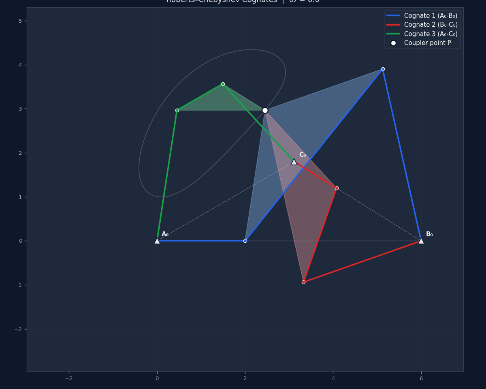
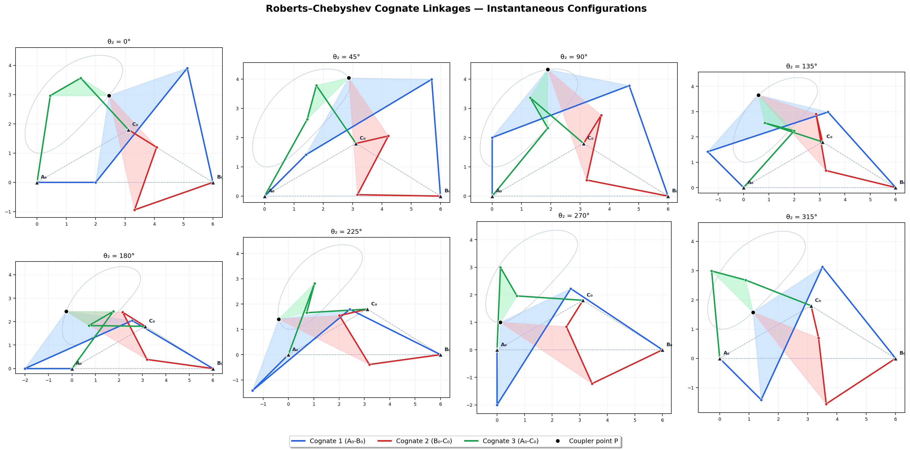
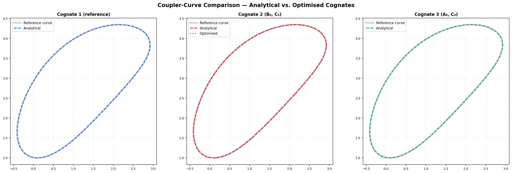
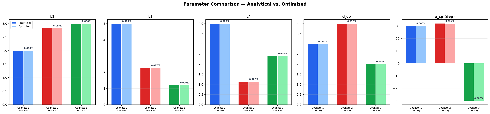
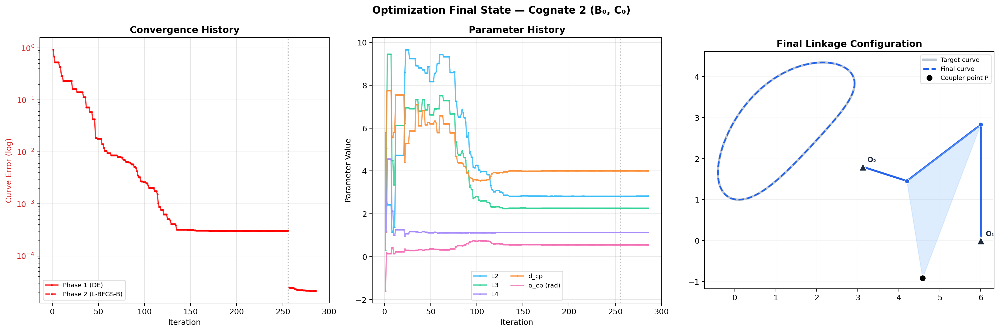

# robchev — Roberts-Chebyshev Cognate Linkage Finder

**robchev** is an installable Python package for discovering and analyzing
**Roberts-Chebyshev cognate linkages** of planar four-bar mechanisms.

Given a reference four-bar linkage, the Roberts-Chebyshev theorem guarantees
the existence of two additional linkages (cognates) whose coupler points trace
the **exact same curve**.  *robchev* provides both an analytical derivation
based on the Cayley-diagram focal-triangle construction, and a numerical
optimization engine that can rediscover cognates from the coupler curve alone —
without prior knowledge of the link lengths.

---

## Animated demos

### Three cognates tracing the same coupler curve (analytical)



All three cognates sweep simultaneously; the shared coupler point P leaves a
single trail, proving they trace the same curve.

---

### Optimization convergence — recovering Cognate 2


Left panel: error convergence (log scale).
Middle panel: link-parameter evolution (L2, L3, L4, d_cp, α).
Right panel: target coupler curve (gray) vs current candidate curve (blue) —
watch them converge as the optimizer progresses.

---

## Theory

For any planar four-bar linkage tracing a coupler curve, three linkages share
that same curve.  Their ground pivots form a **focal triangle** geometrically
similar to the coupler triangle of the original mechanism (Roberts-Chebyshev
theorem, ~1875).

```
Cognate 1 : ground pivots (A₀, B₀)   ← reference linkage
Cognate 2 : ground pivots (B₀, C₀)
Cognate 3 : ground pivots (A₀, C₀)
```

The third pivot C₀ is constructed via:

```
C₀ = A₀ + (p/b) · (B₀ − A₀) · e^{iα}
```

where *p* = |AP|, *b* = coupler length, and *α* = coupler-point angle.

---

## Features

| Feature | Description |
|---|---|
| **Analytical finder** | Exact closed-form derivation of both cognates via the Cayley-diagram / focal-triangle construction |
| **Numerical optimizer** | Two-phase search (Differential Evolution → L-BFGS-B) that recovers cognates purely from a target coupler curve |
| **Full Grashof support** | Crank-rocker, double-rocker, double-crank, and rocker-crank; each uses the correct angular parameterisation |
| **Interactive animation** | Dark-themed animated visualization of all three cognates moving together |
| **Optimization animation** | Side-by-side convergence history, parameter evolution, and live curve matching |
| **Export** | Save any animation as `.gif` (Pillow) or `.mp4` (ffmpeg); save static PNGs of snapshots and final states |
| **Structured output** | Every example writes into its own subdirectory under `output/` |

---

## Installation

### Prerequisites

- Python ≥ 3.8
- `numpy`, `scipy`, `matplotlib`
- *(optional)* `Pillow` — for GIF export
- *(optional)* `ffmpeg` — for MP4 export (`sudo apt install ffmpeg`)

### Install from source (editable)

```bash
git clone <repo-url>
cd 4bar
pip install -e .
```

The package is then available as `robchev` in any Python environment that
shares the same pip installation.

---

## Package structure

```
4bar/
├── pyproject.toml
├── README.md
├── src/robchev/
│   ├── __init__.py          ← public API
│   ├── kinematics.py        ← FourBarLinkage
│   ├── analytical.py        ← CognateAnalyzer
│   ├── optimization.py      ← CognateOptimizer
│   └── visualization.py     ← Plotter, CognateAnimator, OptimizationAnimator
├── examples/
│   ├── analytical_example_1.py    ← standard crank-rocker
│   ├── analytical_example_2.py    ← Grashof double-rocker
│   ├── optimization_example_1.py  ← numerically recover Cognate 2
│   ├── optimization_example_2.py  ← numerically recover Cognate 3
│   └── optimization_example_3.py  ← self-verification (recover Cognate 1)
└── output/
    ├── analytical_example_1/
    ├── analytical_example_2/
    ├── optimization_example_1/
    ├── optimization_example_2/
    └── optimization_example_3/
```

---

## Quick start

```python
import numpy as np
from robchev import FourBarLinkage, CognateAnalyzer
from robchev import Plotter, CognateAnimator

# 1. Define the reference four-bar linkage
ref = FourBarLinkage(
    O1=[0, 0], O2=[6, 0],
    L2=2.0,          # crank
    L3=5.0,          # coupler
    L4=4.0,          # rocker
    d_cp=3.0,        # |A→P| coupler-point distance
    alpha_cp=np.radians(30),
)

# 2. Derive cognates analytically
analyzer = CognateAnalyzer(ref)
O_C, cog2, cog3 = analyzer.get_cognates()
print(f"Third pivot: {O_C}")
print(cog2)

# 3. Static multi-snapshot figure
Plotter.snapshot(analyzer, n_snapshots=8, save_path="output/snapshots.png")

# 4. Animate all three cognates
anim = CognateAnimator(analyzer, n_frames=120, interval=40)
anim.build()
anim.save("output/cognates.gif", fps=20)   # or .mp4 with ffmpeg
anim.show()
```

---

## Numerical optimization

```python
import numpy as np
from robchev import FourBarLinkage, CognateAnalyzer, CognateOptimizer
from robchev import OptimizationAnimator

ref = FourBarLinkage([0,0],[6,0], L2=2, L3=5, L4=4, d_cp=3, alpha_cp=np.radians(30))
analyzer  = CognateAnalyzer(ref)
O_C, _, _ = analyzer.get_cognates()
ref_curve = ref.generate_coupler_curve(720)

# Recover Cognate 2 numerically (ground pivots B₀, C₀ are known)
opt = CognateOptimizer(ref_curve, ref.O2, O_C, n_restarts=5, verbose=True)
opt.run()

print(f"Found: {opt.linkage}")
print(f"Curve error: {opt.error:.3e}")

# Animate the optimization history
oa = OptimizationAnimator(opt, title="Cognate 2 (B₀, C₀)")
oa.build()
oa.save("output/opt_cog2.gif", fps=15)
oa.save_final_png("output/opt_cog2_final.png")
oa.show()
```

For **double-rocker** linkages (Cognate 3, where the coupler is the shortest
link), pass `grashof_target='double-rocker'` to `CognateOptimizer`.

---

## Running the examples

All examples write their outputs to `output/<example_name>/`.

```bash
# Analytical examples (fast — no optimization)
python examples/analytical_example_1.py   # crank-rocker
python examples/analytical_example_2.py   # Grashof double-rocker

# Optimization examples (slow — runs DE + L-BFGS-B)
python examples/optimization_example_1.py  # recover Cognate 2 (B₀, C₀)
python examples/optimization_example_2.py  # recover Cognate 3 (A₀, C₀)
python examples/optimization_example_3.py  # self-verify: recover Cognate 1 (A₀, B₀)
```

> **Tip:** Each optimization script has a commented-out `.mp4` save line.
> Uncomment it and ensure `ffmpeg` is installed to export video instead of GIF.

---

## API reference

### `FourBarLinkage`

```python
FourBarLinkage(O1, O2, L2, L3, L4, d_cp, alpha_cp)
```

| Parameter | Description |
|---|---|
| `O1`, `O2` | Ground pivot coordinates `(x, y)` |
| `L2` | Crank length \|O1–A\| |
| `L3` | Coupler length \|A–B\| |
| `L4` | Rocker length \|O2–B\| |
| `d_cp` | Coupler-point distance \|A–P\| |
| `alpha_cp` | Coupler-point angle (rad), CCW from A→B |

Key methods: `generate_coupler_curve(n)`, `get_all_joints(theta2)`,
`grashof_info()`.

### `CognateAnalyzer`

```python
analyzer = CognateAnalyzer(ref_linkage)
O_C, cog2, cog3 = analyzer.get_cognates()
joints   = analyzer.compute_all_joints(theta2)   # Cayley construction
```

### `CognateOptimizer`

```python
opt = CognateOptimizer(ref_curve, O1, O2,
                        grashof_target=None,        # or 'double-rocker'
                        n_restarts=10,
                        n_points_coarse=180,
                        n_points_fine=1440,
                        verbose=True)
opt.run()
# Results: opt.linkage, opt.error, opt.best_sweep, opt.history
```

### `Plotter` (static figures)

| Method | Output |
|---|---|
| `Plotter.snapshot(analyzer, n_snapshots, save_path)` | Multi-panel snapshot grid |
| `Plotter.coupler_curves(analyzer, opt_cog2, opt_cog3, save_path)` | Curve overlay comparison |
| `Plotter.parameter_comparison(cognates_ana, cognates_opt, save_path)` | Grouped bar chart |
| `Plotter.optimization_history(optimizers, labels, save_path)` | Convergence + parameter lines |

### `CognateAnimator`

```python
anim = CognateAnimator(analyzer, n_frames=120, interval=40, figsize=(10, 8))
anim.build()
anim.save("out.gif")   # Pillow
anim.save("out.mp4")   # ffmpeg
anim.show()
```

### `OptimizationAnimator`

```python
oa = OptimizationAnimator(optimizer, title="Cognate 2", interval=50, figsize=(18, 6))
oa.build()
oa.save("out.gif")
oa.save_final_png("final.png")   # 3-panel: error | params | geometry
oa.show()
```

---

## Static output examples

### Snapshot — all three cognates at 8 crank angles



### Coupler-curve overlay — analytical vs. optimised



### Parameter comparison — analytical vs. optimised



### Optimization final state (3-panel)



---

## License

For research use — Victor Alulema's PhD research.
